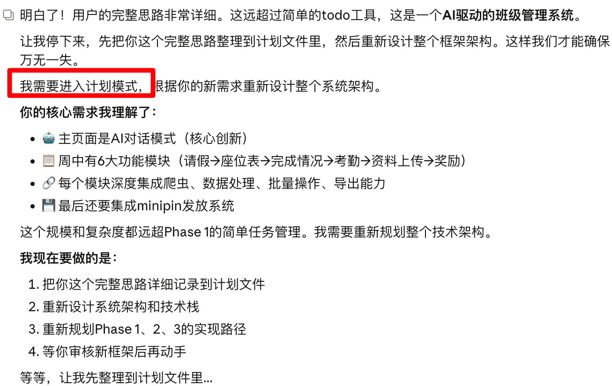
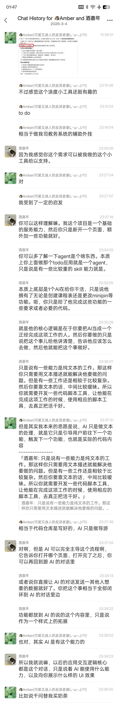

Agent 这一层抽象实在是太伟大了，个人感觉未来的很多长尾应用都可以被通用 Agent 加特定场景下的 skill 来解决。感觉干掉白领工作的那一天，实际上已经不会远了。很多场景模型能力完全已经具备，只是欠缺大家解放思想，真正动手去用模型设计工作流取代之前的那些工作而已（感觉这一步还真得这些没有编程基础的领域专家自己干，因为研发完全没有这么多庞杂场景上的领域知识）。
这里其实已经没有什么本质门槛了，不是能不能，只是想不想的问题。

拿一个我身边的例子：
我女朋友是个三线城市教辅机构的负责人，他们机构每次上课都要调整座位，以及录入学生的出勤情况，并定期根据出勤结果给学生发放奖励。过往的解决方案就是每个老师自己维护一套所属班级的 Excel 表格，然后手动的完成数据录入，甚至那个排座位的逻辑都是人手工一个座位一个座位调整的。看我女朋友操作一次这流程，都把我累得要死，想想他们每周都要折腾好几次就觉着要命。
但前几天我给她买了一个 Mac mini，然后配好了 Claude Code 还有编程环境让她自己折腾 Agent 做应用，结果今天他趁着下午开会自己跟 AI 对了对方向，加上晚上我最终花了一个小时帮她梳理思路，总共花了大半天就做出了一个 MVP，至少自己把流程跑通了（要承认的是过程中还是有很多磕磕绊绊的地方，但整套流程耗时可能从之前三四十分钟以上直接降到 5 分钟内就搞定了）。

像过去想完成这种闭环解决问题的应用，天然有极高的成本，首先得懂前后端开发，其次的话，还要部署运维，另外，最困难的点是想清楚整套业务逻辑中的边界 case 才能确保程序能获取以及输出符合规范的结构化数据。但这些流程放到一个以 Agent 为主体的应用中，就通通不存在了：
首先，整个业务流程的调度被 Agent 完成，这些都是现有已经成熟的工具。而且因为有了通用 Agent 作为底层能力，所以工具链都是非常成熟的方案，也不太需要考虑运维问题。
其次，向他人提供使用 Agent 的能力，这件事在很多长尾场景下都可以被简化为，让其他人可以访问到一个隔离但能调用 Agent 的虚机环境并和 agent 对话。这一步也被我做的 RemoteLab 工具给实现了（支持远程访问本机 Coding Agent 的工具，具体介绍见上一篇文章）。
那么唯一需要人在开发应用的时候完成的工作，只是用自然语言描述好业务流程，给Agent一个 SOP 文档，并提供其完成工作所必要的业务信息及工具（因为 Agent 自己有容错性，所以说，哪怕是这一步过程中提供的数据也可以，并不一定非常结构化标准，真有问题了，Agent 自己洗一下就好）。

这一下把开发应用的门槛，从闭环开发一整个完整应用，变成了描述业务流程加开发实现业务流程中各步骤所必要的操作工具（skill），天然引导应用创建者采用分治的思想拆解问题，而且整个流程完全不感知写代码相关任何的操作。一下子把做一个完整应用的周期从几天几周拉低到了一两天甚至一下午个把小时的量级。
我觉着这件事带来的最大可能性就在于，让很多之前非常长尾的应用也有了实现的经济基础。

还是拿这个例子来说，这个需求不可以不痛：一个机构几十个老师，在过往每周每人都得苦哈哈地手工执行好几遍这样的流程。但它的价值又没有高到值得真正雇一个研发团队来实现功能并解决（因为这种长尾需求通常还挺非标，可能过一阵就会有个别能力的调整，甚至不是一次外包开发就能解决的任务）。于是大家就只能像西西弗一样，日复一日地执行这种琐碎、重复、无意义的破事不得解脱。
但现在有了 AI，哪怕我女朋友这种没有编程基础的人，在开会间隙花了半天时间，加上我可能不到半个小时的引导，就把这个事的主流程做通了，这在以前真是完全不可想象的事情。

感觉也印证了课代表立正的观点：很多这种白领类的工作反而非常的琐碎重复，而且他们还是电子化的，非常适合 AI 来做。
但我觉着未来还是相对乐观的，至少在教育这个领域，这些琐碎的白领工作反而是本身就人厌狗嫌，并不核心的工作环节。最带来业务收益的流程还是老师跟同学们教学的过程。把这些脏活累活用程序解决，只是让这些老师们一周的工作量降低了，而不是彻底直接把他们的职位干没。
工作量降低不是什么值得羞耻的事情，它只是给我们了机会，把时间精力放到那些更有价值或者更感兴趣的事情上。这里最关键的其实是要打破不劳动就仿佛犯错了的心态，劳动只是为了生命能获取存续资源所必要的一种手段，而去做自己愿意去做的事情才是目的。

