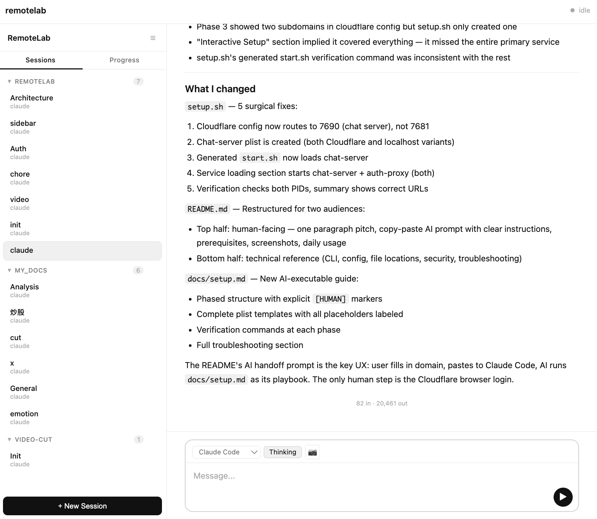

# 离开电脑 AI 就停工？我给 Coding Agent 做了个手机遥控

质疑资本家、理解资本家、成为资本家。

最近每个月花200刀买 CodeX 和 Claude Code 的会员之后，我实在无法接受我的 Coding Agent 有任何的休息时间。我在干活的时候他得干活，我在吃饭的时候，难道他就不干活了吗？我觉得不合理，要不然我这200美刀不是白掏了吗？

但吃饭的时候总不方便随身天天背个大电脑，所以还是得找个手机就能操控 Agent 的办法。

幸好现在我的工作流基本上都是 Vibe Coding 的模式，其实也不太需要真的打开某一个 IDE，它纯粹就是在一个 Session 里边跟 CodeX 对话就好了。反正我又不需要看 IDE，只是聊天对话的话，有个手机屏幕是不是也就够用了。

因而我最近自己实现了一套手机远程连接电脑上 Coding Agent 的小工具网站，能让我在手机上操纵 CodeX 帮我继续干活。现在吃饭的时候，我的好哥们们终于也能继续干活了，终于值回我这200美刀的票价了。

我自己觉得这套流程还挺好用的，所以把代码开源了，如果大家感兴趣也可以自己跑一个服务。希望能帮你在吃饭、睡觉、等车的时候，也能 Push AI 继续干活。

## 这个工具长什么样

本质上它的界面和我们常规使用的 GPT、CC 之类都大差不差，还是 Session + Chat 的逻辑。

但它现在并不依赖你一定要在本地的电脑上打开，它是一个公网可以访问的路径。也就是说，我们完全可以在手机上也打开这个网页，操纵我们本地的电脑，通过这个页面跟本地的 CC 或者 CodeX 对话，让他们修改真正的代码文件。从而起到手机端跟在电脑上几乎一样的 Coding 体验。

## 为什么不用官方方案

大家可能会问了，现在 Claude 也推出了 Remote Control 的能力，那为什么我们不用官方的方案，而是用一种接近于自定义的方案呢？

**核心逻辑在于：有了 AI 之后，我们的开发效率是成倍提升的。** 很多过去觉得颠覆不变的真理，其实是会被推翻的。

比如说"不要重复造轮子"这种思路，其实是相信有一个人能把所有的需求抽象清楚，然后帮我们全部搞定。但事实上每个人都有自己非常独特的需求场景。尤其是在 AI Coding 这个领域，因为人跟 AI 的协作实际上更像是两个人之间的交流，而不是一个固化的结构。所以说它其实是非常非标的。

我们每个人可能都有自己习惯与 AI 交互的方式，那每个人的习惯不同，也就导致了我们与 AI 交互思路、使用模式细节的出入。一个官方给的通用实践不一定是最好的方案。

而且如果以后 CodeX 或者 Gemini 能力提升，我们到底是用它们还是不用它们呢？归根结底，我们其实应该让自己使用的日常工具本身足够中立，因而也就可以很动态地切换其他模型，不至于绑到具体的一个模型厂商之上。

何况现在 CC 的 Remote Control 确实也有一大堆毛病。只能开一个 Session，麻烦不说，他自己好像也没有做保活以及避免系统休眠的机制。过个20分钟你的 Mac 休眠了，Session 就断了，岂不是非常滑稽？

## 每个人都应该部署一个这样的服务

大家应该都去部署这样一个服务，尽量让自己的工作流数据源是统一的。我们可能用无数个终端，无论是 iPad、手机或者是电脑，都可以操纵同一份数据。这样才能保证我们的上下文永远是对齐的，不至于在一个设备改了半天，但是发现自己要换到另一个设备操作的时候，还要再去做数据迁移的事情。那实在是太过麻烦了。

## 怎么接入

现在其实也非常简单了，拉取项目后，我们甚至都不需要肉眼去看那个 README，反正 AI 帮我们全部处理就好。我们只需要告诉它我们要接入这个项目，然后让它一步步帮我们去做。具体哪块如果它能搞定就让它来搞定，如果它搞不定再让人手工介入一下就好，流程并没有太多复杂的。

发完这条消息之后，Claude 就会自己分析这个项目加上 README，然后帮我们看怎么接入。其实大多数流程它都能搞定，只是有一些人工授权的工作需要我们来做就好。

其中可能最复杂的一步流程就是我们需要一个 Cloudflare 的 Tunnel 来代理出真正的地址，只要把这步完成之后，它就会自动启动服务。Claude Code 会自己分析项目的逻辑，然后把服务对应的地址直接发给我们，我们只需要在手机端复制链接打开，就可以进入 ChatUI 开始远程 Coding 了。

终于可以让模型过上996的人生了。

---

以上就是这个小工具的全部内容了。如果大家对这个工具有什么意见建议，也可以在评论区留言，或者提 GitHub Issue。期待大家的反馈。
