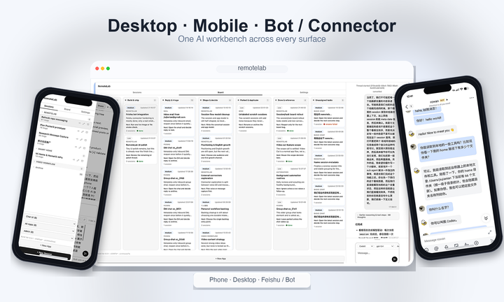

最近一直在花很多精力折腾 remotelab，但突然发现好像一直没有好好完整介绍过它，今天就简单说一下。

产品的前端其实很简洁，无非是一个支持多端（包括 PC、移动以及各式聊天工具）访问的会话界面（顺便支持了项目看板），但我不太打算讲那么多详细的产品功能细节，功能持续迭代产品的 UI 大抵也会不断地改变，但设计的一些基本原则和信念应该是相对稳定的，所以今天更多讲讲我做这个产品的理念和思考。

首先得先说清楚，这个东西其实不是一个简单的 AI 聊天框，也不是给 CodeX 或者 CC 这种工具外面再包一层 UI。我真正想做的，本质上是一个在 Agent 层之上的管理调度层。换句话说，就是一个给超级个体用的 AI 工作台。

我会越来越觉得，在未来人与 AI 的协作里，人更应该负责的是定方向、做判断和拍板，AI 去负责具体的执行流程。人没必要一直盯着每一个执行细节，而是应该慢慢从执行层里抽出来，把注意力放到更宏观的整体进展、优先级，以及接下来到底该做什么这些事情上。

因为我最近一个很强烈的感受就是，随着 AI 能力继续变强，单任务的 scope 一定会越来越大。过去它们更多只是帮我们解决 5 分钟、10 分钟的小问题，但现在顶级 Agent 其实已经可以独立做掉好几个小时的任务了。再往后，天级甚至周级的任务，我觉得都不是什么不能想象的事情。那到时候真正的瓶颈就不再是 AI 够不够聪明，而是人能不能管好自己手底下这一堆 AI 同事，能不能在它们几个小时后回来找你的时候，还记得当初把这件事交出去的目的是什么，以及下一步该让它们继续做什么。

所以说，AI 时代真正大的提效，我觉得核心其实不是把单个任务再卷快一点，而是怎么把并发真正跑起来。而这一步现在看，瓶颈反而更在人脑自己，上下文窗口长期都处在爆栈状态。这件事本质上已经慢慢从“把一个具体任务描述清楚”变成了项目管理，只不过以前是人管人，现在是人管无限多个 AI。

RemoteLab 想解决的，其实就是这一层 Agent 之上的问题。我们不打算去做一个单任务完成得比 CodeX 或者 CC 更好的 Agent，而是更想复用这些现成强执行器的能力，去完成 Agent 之间的调度编排，去帮助人做项目管理，同时给人一个多端介入的界面，让你不再被绑死在某一张工作桌前。既然我们已经更像一个管理者了，那其实也就没必要一直守在电脑边上。你可以随时随地用文字去指导它们的行为，不管你现在是在电脑上、手机上，还是在飞书或者其他平台的 Bot 上和 AI 联系，背后都应该还是同一套长期工作的系统。

另外还有一点我挺想做的，是 AI 时代的能力平权。我越来越觉得，很多 Agent Native 应用最后都会长得很像 Chat，只不过它背后带着某个特定领域的知识、SOP 和 workflow，能帮人把一整套事情顺下来。但问题在于，这些领域里最懂业务的人，未必是程序员。他们知道问题在哪，也知道流程应该怎么走，却不一定有能力把它完整做成一个应用。所以我会希望这个项目能帮他们尽可能低成本地把自己的 workflow 搭起来并分发出去，让更多人都能直接用上那些高阶用户自己打磨出来的优秀工作流。

我其实不太希望 AI 最后只是进一步拉大人与人的差距。我更希望它能真正进入每个人的生产和生活里，让更多人都能因为这些工具受益。这个工具现在当然还在一个挺早期的制作和调研阶段，但我自己是非常相信这个方向的。而且我平时其实已经很深度地在用它了，日常开发和 AI 协作的很多流程都已经跑在这上面。说实话，它现在肯定还有很多地方没长完，但我自己的体感是，这套体验已经让我挺舍不得换回别的东西了。

如果你平时也高频使用 AI，对我想做的这个方向感兴趣，欢迎来试，也欢迎反馈。如果你用下来有任何问题，或者有觉得特别痛、特别想解决的场景，也都欢迎直接跟我说。可以去 [GitHub 提 issue](https://github.com/Ninglo/remotelab/issues)。先提前谢谢大家的反馈！
